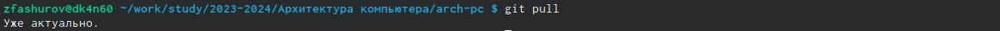
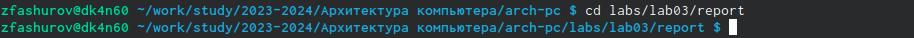
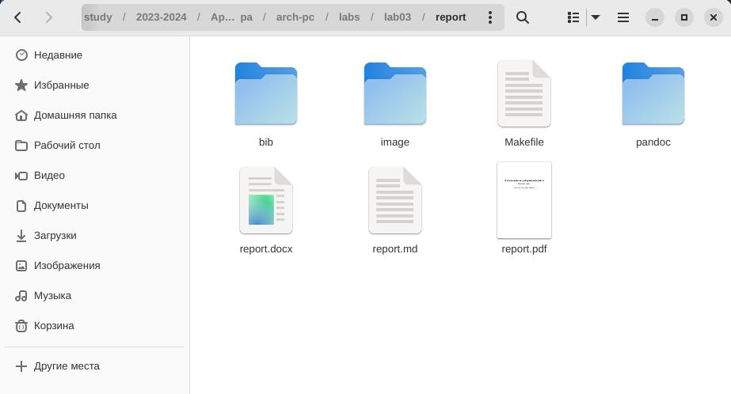
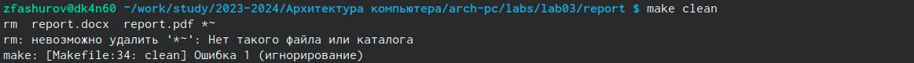
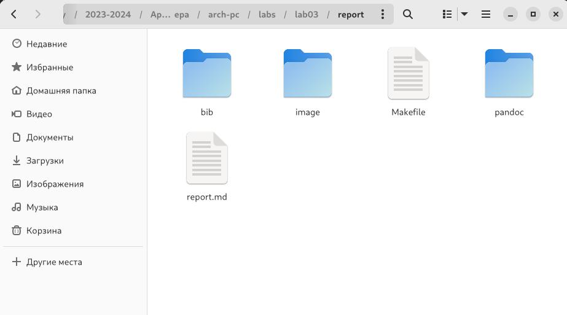
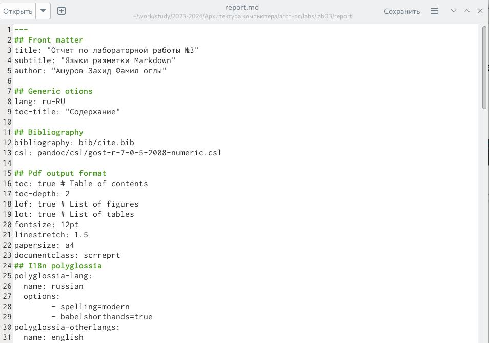
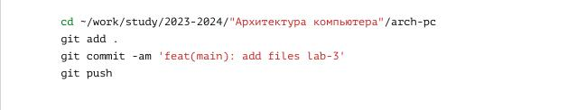

---
## Front matter
title: "Отчет по лабораторной работы №3"
subtitle: "Языки разметки Markdown"
author: "Ашуров Захид Фамил оглы"

## Generic otions
lang: ru-RU
toc-title: "Содержание"

## Bibliography
bibliography: bib/cite.bib
csl: pandoc/csl/gost-r-7-0-5-2008-numeric.csl

## Pdf output format
toc: true # Table of contents
toc-depth: 2
lof: true # List of figures
lot: true # List of tables
fontsize: 12pt
linestretch: 1.5
papersize: a4
documentclass: scrreprt
## I18n polyglossia
polyglossia-lang:
  name: russian
  options:
	- spelling=modern
	- babelshorthands=true
polyglossia-otherlangs:
  name: english
## I18n babel
babel-lang: russian
babel-otherlangs: english
## Fonts
mainfont: PT Serif
romanfont: PT Serif
sansfont: PT Sans
monofont: PT Mono
mainfontoptions: Ligatures=TeX
romanfontoptions: Ligatures=TeX
sansfontoptions: Ligatures=TeX,Scale=MatchLowercase
monofontoptions: Scale=MatchLowercase,Scale=0.9
## Biblatex
biblatex: true
biblio-style: "gost-numeric"
biblatexoptions:
  - parentracker=true
  - backend=biber
  - hyperref=auto
  - language=auto
  - autolang=other*
  - citestyle=gost-numeric
## Pandoc-crossref LaTeX customization
figureTitle: "Рис."
tableTitle: "Таблица"
listingTitle: "Листинг"
lofTitle: "Список иллюстраций"
lotTitle: "Список таблиц"
lolTitle: "Листинги"
## Misc options
indent: true
header-includes:
  - \usepackage{indentfirst}
  - \usepackage{float} # keep figures where there are in the text
  - \floatplacement{figure}{H} # keep figures where there are in the text
---


1. Цель работы

2. Задание

3. Теоритическое введение

4. Выполнение лабораторной работы

5. Выводы

# Цель работы
Освоить процедуры оформления отчетов с помощью легковесного языка разметки Markdown.

# Задание

Здесь приводится описание задания в соответствии с рекомендациями
методического пособия и выданным вариантом.

# Теоретическое введение

* Базовые сведения о Markdown 

Чтобы создать заголовок, используйте знак #, например: 
# This is heading 1
## This is heading 2
### This is heading 3
#### This is heading 4

Чтобы задать для текста полужирное начертание, заключите его в двойные звездочки: 
This text is **bold**.

Чтобы задать для текста курсивное начертание, заключите его в одинарные звездочки: 
This text is *italic*.

Чтобы задать для текста полужирное и курсивное начертание, заключите его в тройные звездочки: 
This is text is both ***bold and italic***.
 
Блоки цитирования создаются с помощью символа >: 
> The drought had lasted now for ten million years, and the reign of the
    • ↪  terrible lizards had long since ended. Here on the Equator, in the 
    • ↪  continent which would one day be known as Africa, the battle for existence 
    • ↪  had reached a new climax of ferocity, and the victor was not yet in sight. 
    • ↪  In this barren and desiccated land, only the small or the swift or the 
    • ↪  fierce could flourish, or even hope to survive. 
    
Упорядоченный̆ список можно отформатировать с помощью соответствующих цифр: 
1. First instruction
   1.   Sub-instruction
   1.   Sub-instruction
1. Second instruction

Чтобы вложить один список в другой, добавьте отступ для элементов дочернего списка: 
1.        First instruction
1.        Second instruction
1.        Third instruction

Неупорядоченный (маркированный) список можно отформатировать с помощью звездо- чек или тире: 
*  List item 1
*  List item 2
*  List item 3

Чтобы вложить один список в другой, добавьте отступ для элементов дочернего списка: 
- List item 1
  - List item A
  - List item B
- List item 2 

Синтаксис Markdown для встроенной ссылки состоит из части [link text], представляющей текст гиперссылки, и части (file-name.md) – URL-адреса или имени файла, на который дается ссылка: 
[link text] (file-name.md)

или

[link text] (http://example.com/ "Необязательная подсказка")

Markdown поддерживает как встраивание фрагментов кода в предложение, так и их размещение между предложениями в виде отдельных огражденных блоков. Огражденные блоки кода — это простой способ выделить синтаксис для фрагментов кода. Общий формат огражденных блоков кода: 

``` language
your code goes in here
```

* Оформление формул в Markdown 

Внутритекстовые формулы делаются аналогично формулам LaTeX. Например, формула sin2(𝑥) + cos2(𝑥) = 1 запишется как
 
$\sin^2 (x) + \cos^2 (x) = 1$

Выключение формулы: 

      sin2(𝑥) + cos2(𝑥) = 1

    со ссылкой в тексте «Смотри формулу ({-eq. 3.1}).» записывается как 


* Оформление изображений в Markdown

В Markdown вставить изображение в документ можно с помощью непосредственного
указания адреса изображения. Синтаксис данной команды выглядит следующим образом:

Здесь:

  • в квадратных скобках указывается подпись к изображению;

  • в круглых скобках указывается URL-адрес или относительный путь изображения, а так-
  же (необязательно) всплывающую подсказку, заключённую в двойные или одиночные
  кавычки.

  • в фигурных скобках указывается идентификатор изображения (#fig:fig1) для ссылки
  на него по тексту и размер изображения относительно ширины страницы (width=90%)

Ссылка на изображение (рис. 3.1) может быть оформлена следующим образом (рис. [-
@fig:fig1])

* Обработка файлов в формате Markdown

Преобразовать файл README.md можно следующим образом:

pandoc README.md -o README.pdf

или так

pandoc README.md -o README.docx

Для компиляции отчетов по лабораторным работам предлагается использовать следую-
щий Makefile

FILES = (patsubst %.md, %.docx, (wildcard *.md))
FILES += (patsubst %.md, %.pdf, (wildcard *.md))

LATEX_FORMAT =

FILTER = --filter pandoc-crossref

%.docx: %.md
    -pandoc "<" (FILTER) -o "@"

%.pdf: %.md
    -pandoc "<" (LATEX_FORMAT) (FILTER) -o "@"

all: (FILES)
    @echo (FILES)

clean:
    -rm (FILES) *~


# Выполнение лабораторной работы

Открываем терминал.

Переходим в каталог курса, сделанный на лабораторной работе №2. (Рис. @fig:001).

{#fig:001 width=70% }

Обновим локальный репозиторий, скачав изменения из удаленного репозитория (Рис. @fig:002).

{#fig:002 width=70% }

Перейдем в каталог с шаблоном отчета по лабораторной работе №3 (Рис. @fig:003).

{#fig:003 width=70% }

Проведем компиляцию шаблона с использование Makefile. (Рис. @fig:004).

{#fig:004 width=70% }

При успешной компиляции должны появиться файлы report.pdf и report.dock. Проверяем корректность полученных файлов. (Рис. @fig:005).

{#fig:005 width=70% }

Удаляем полученные файлы с использованием Makefile. (Рис. @fig:006).

{#fig:006 width=70% }

Проверим, что после команды "make clean" файлы report.dock и report.pdf были успешно удалены. (Рис. @fig:007).

{#fig:007 width=70% }

Откроем файл report.md с помощью редактор. (Рис. @fig:008).

{#fig:008 width=70% }

Загрузим файлы на git.hub. (Рис. @fig:009).

{#fig:009 width=70%}

# Выводы

При выполнении лабораторной работы я освоил процедуры оформления отчетов с помощью легковесного языка разметки Markdown.

# Список литературы{.unnumbered}

::: {#refs}
:::
