---
## Front matter
title: "Отчет по лабораторной работе №5"
subtitle: "Основы работы с Midnight Commander (mc). Структура программы на языке ассемблера NASM. Системные вызовы в ОС GNU Linux"
author: "Ашуров Захид Фамил оглы"

## Generic otions
lang: ru-RU
toc-title: "Содержание"

## Bibliography
bibliography: bib/cite.bib
csl: pandoc/csl/gost-r-7-0-5-2008-numeric.csl

## Pdf output format
toc: true # Table of contents
toc-depth: 2
lof: true # List of figures
lot: true # List of tables
fontsize: 12pt
linestretch: 1.5
papersize: a4
documentclass: scrreprt
## I18n polyglossia
polyglossia-lang:
  name: russian
  options:
	- spelling=modern
	- babelshorthands=true
polyglossia-otherlangs:
  name: english
## I18n babel
babel-lang: russian
babel-otherlangs: english
## Fonts
mainfont: PT Serif
romanfont: PT Serif
sansfont: PT Sans
monofont: PT Mono
mainfontoptions: Ligatures=TeX
romanfontoptions: Ligatures=TeX
sansfontoptions: Ligatures=TeX,Scale=MatchLowercase
monofontoptions: Scale=MatchLowercase,Scale=0.9
## Biblatex
biblatex: true
biblio-style: "gost-numeric"
biblatexoptions:
  - parentracker=true
  - backend=biber
  - hyperref=auto
  - language=auto
  - autolang=other*
  - citestyle=gost-numeric
## Pandoc-crossref LaTeX customization
figureTitle: "Рис."
tableTitle: "Таблица"
listingTitle: "Листинг"
lofTitle: "Список иллюстраций"
lotTitle: "Список таблиц"
lolTitle: "Листинги"
## Misc options
indent: true
header-includes:
  - \usepackage{indentfirst}
  - \usepackage{float} # keep figures where there are in the text
  - \floatplacement{figure}{H} # keep figures where there are in the text
---

# Цель работы

Приобрести практические навыки работы в Midnight Commander. Освоить инструкцию языка ассемблера mov и int

# Задание

Подключение внешнего файла in_out.asm

# Теоретическое введение

* Основы работы с Midnight Commander
	Midnight Commander (или просто mc) — это программа, которая позволяет просматривать
структуру каталогов и выполнять основные операции по управлению файловой системой,
т.е. mc является файловым менеджером. Midnight Commander позволяет сделать работу с
файлами более удобной и наглядной.
	Для активации оболочки Midnight Commander достаточно ввести в командной строке mc и
нажать клавишу Enter.
	В Midnight Commander используются функциональные клавиши F1 — F10 , к которым
привязаны часто выполняемые операции.

Дополнительную информацию о Midnight Commander можно получить по команде man
mc и на странице проекта.

* Структура программы на языке ассемблера NASM
	Программа на языке ассемблера NASM, как правило, состоит из трёх секций: секция кода
программы (SECTION .text), секция инициированных (известных во время компиляции)
данных (SECTION .data) и секция неинициализированных данных (тех, под которые во
время компиляции только отводится память, а значение присваивается в ходе выполнения
программы) (SECTION .bss).
	Таким образом, общая структура программы имеет следующий вид:
	
SECTION .data ; Секция содержит переменные, для
... ; которых задано начальное значение
SECTION .bss ; Секция содержит переменные, для
... ; которых не задано начальное значение
SECTION .text ; Секция содержит код программы
GLOBAL _start
_start: ; Точка входа в программу
... ; Текст программы
mov eax,1 ; Системный вызов для выхода (sys_exit)
mov ebx,0 ; Выход с кодом возврата 0 (без ошибок)
int 80h ; Вызов ядра

	Для объявления инициированных данных в секции .data используются директивы DB, DW,
DD, DQ и DT, которые резервируют память и указывают, какие значения должны храниться в
этой памяти:

• DB (define byte) — определяет переменную размером в 1 байт;
• DW (define word) — определяет переменную размеров в 2 байта (слово);
• DD (define double word) — определяет переменную размером в 4 байта (двойное слово);
• DQ (define quad word) — определяет переменную размером в 8 байт (учетверённое слово);
• DT (define ten bytes) — определяет переменную размером в 10 байт

	Директивы используются для объявления простых переменных и для объявления масси-
вов. Для определения строк принято использовать директиву DB в связи с особенностями
хранения данных в оперативной памяти.
	Синтаксис директив определения данных следующий:

<имя> DB <операнд> [, <операнд>] [, <операнд>]

	Для объявления неинициированных данных в секции .bss используются директивы resb,
resw, resd и другие, которые сообщают ассемблеру, что необходимо зарезервировать за-
данное количество ячеек памяти. 

* Элементы программирования
* Описание инструкции mov

	Инструкция языка ассемблера mov предназначена для дублирования данных источника в
приёмнике. В общем виде эта инструкция записывается в виде
mov dst,src

	Здесь операнд dst — приёмник, а src — источник.
	В качестве операнда могут выступать регистры (register), ячейки памяти (memory) и непо-
средственные значения (const). В табл. 5.4 приведены варианты использования mov с разны-
ми операндами.

	ВАЖНО! Переслать значение из одной ячейки памяти в другую нельзя, для этого необхо-
димо использовать две инструкции mov:

mov eax, x
mov y, eax

	Также необходимо учитывать то, что размер операндов приемника и источника должны
совпадать. Использование слудующих примеров приведет к ошибке:

• mov al,1000h — ошибка, попытка записать 2-байтное число в 1-байтный регистр;
• mov eax,cx — ошибка, размеры операндов не совпадают.

* Описание инструкции int
	Инструкция языка ассемблера intпредназначена для вызова прерывания с указанным
номером. В общем виде она записывается в виде

int n

	Здесь n — номер прерывания, принадлежащий диапазону 0–255.
	При программировании в Linux с использованием вызовов ядра sys_calls n=80h (принято
задавать в шестнадцатеричной системе счисления).

	После вызова инструкции int 80h выполняется системный вызов какой-либо функции
ядра Linux. При этом происходит передача управления ядру операционной системы. Чтобы
узнать, какую именно системную функцию нужно выполнить, ядро извлекает номер систем-
ного вызова из регистра eax. Поэтому перед вызовом прерывания необходимо поместить в
этот регистр нужный номер. Кроме того, многим системным функциям требуется передавать
какие-либо параметры. По принятым в ОС Linux правилам эти параметры помещаются в по-
рядке следования в остальные регистры процессора: ebx, ecx, edx. Если системная функция
должна вернуть значение, то она помещает его в регистр eax.

* Системные вызовы для обеспечения диалога с пользователем

	Простейший диалог с пользователем требует наличия двух функций — вывода текста на
экран и ввода текста с клавиатуры. Простейший способ вывести строку на экран — использо-
вать системный вызов write. Этот системный вызов имеет номер 4, поэтому перед вызовом
инструкции int необходимо поместить значение 4 в регистр eax. Первым аргументом write,
помещаемым в регистр ebx, задаётся дескриптор файла. Для вывода на экран в качестве
дескриптора файла нужно указать 1 (это означает «стандартный вывод», т. е. вывод на экран).
Вторым аргументом задаётся адрес выводимой строки (помещаем его в регистр ecx, напри-
мер, инструкцией mov ecx, msg). Строка может иметь любую длину. Последним аргументом
(т.е. в регистре edx) должна задаваться максимальная длина выводимой строки.
	Для ввода строки с клавиатуры можно использовать аналогичный системный вызов read.
Его аргументы – такие же, как у вызова write, только для «чтения» с клавиатуры используется
файловый дескриптор 0 (стандартный ввод).
	Системный вызов exit является обязательным в конце любой программы на языке ассем-
блер. Для обозначения конца программы перед вызовом инструкции int 80h необходимо
поместить в регистр еах значение 1, а в регистр ebx код завершения 0.

# Выполнение лабораторной работы

Открываем Midnight Commander (Рис. @fig:001).

{#fig:001 width=70%}

Перейти в каталог созданный при выполнении работы №4 (Рис. @fig:002).

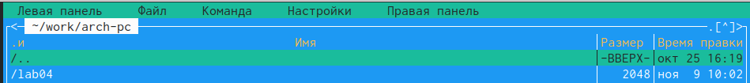{#fig:002 width=70%}

Создаем папку lab05 (Рис. @fig:003).

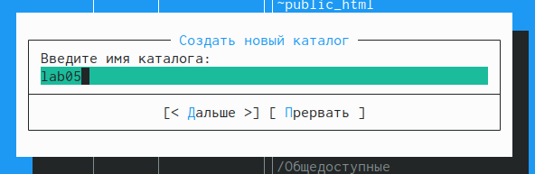{#fig:003 width=70%}

Удостоверимся в корректности выполнения (Рис. @fig:004).

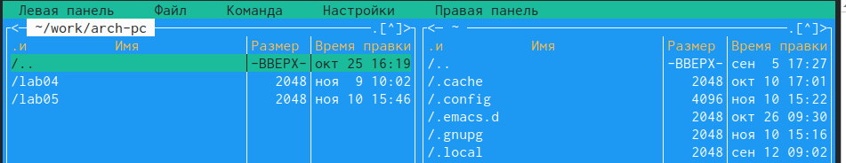{#fig:004 width=70%}

Переходим в созданную папку (Рис. @fig:005).

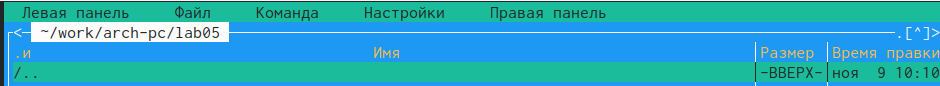{#fig:005 width=70%}

Создаем файл lab5-1.asm командой touch (Рис. @fig:006).

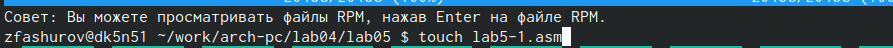{#fig:006 width=70%}

Вводим текст программы (Рис. @fig:007).

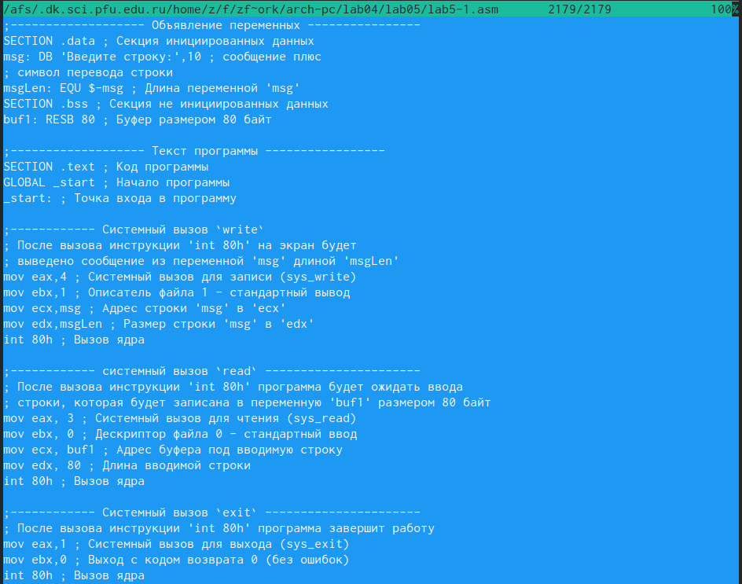{#fig:007 width=70%}

Сохраняем текст программы (Рис. @fig:008).

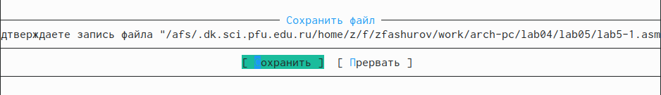{#fig:008 width=70%}

Просмотрим файл lab5-1.asm с помощью функциональной клавиши F3 (Рис. @fig:009)

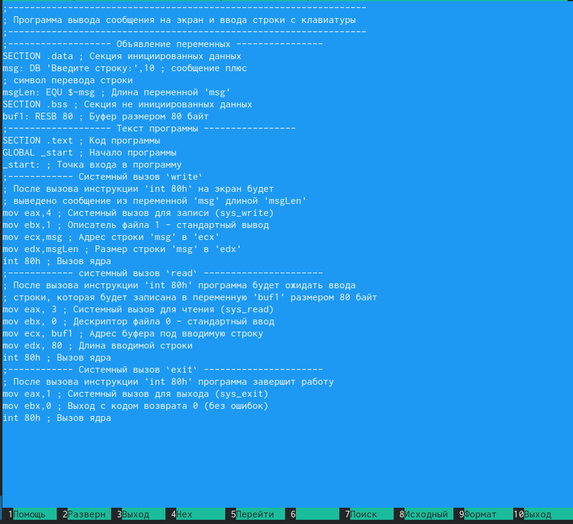{#fig:009 width=70%}

Оттранслируем текст программы lab5-1.asm в объектный файл (Рис. @fig:010).

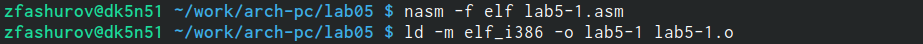{#fig:010 width=70%}

Запустим получившийся исполняемый файл (Рис. @fig:011).

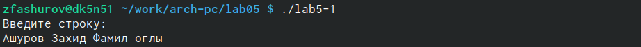{#fig:011 width=70%}

Скачиваем файл in_out.asm со страницы курса в ТУИС. (Рис. @fig:012).

{#fig:012 width=70%}

Проверяем чтоб файл in_out.asm лежал в нужно каталоге (Рис. @fig:013).

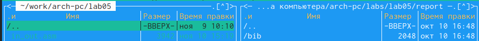{#fig:013 width=70%}

Создаем копию файла lab5-1.asm с именем lab5-2.asm (Рис. @fig:014).

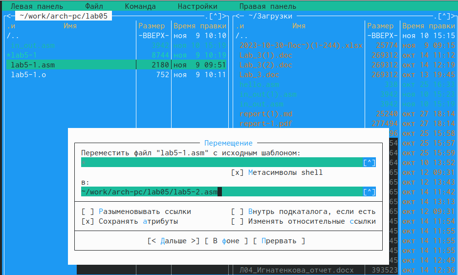{#fig:014 width=70%}

Редактируем текст программы в файле lab5-2.asm (Рис. @fig:015).

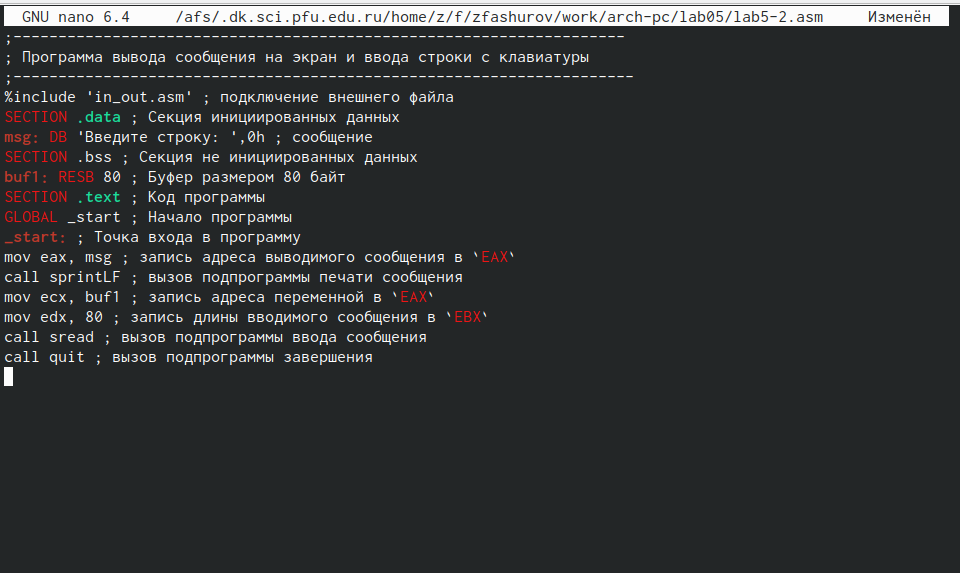{#fig:015 width=70%}

Заменяем подпрограмму sprintLF на sprint (Рис. @fig:016).

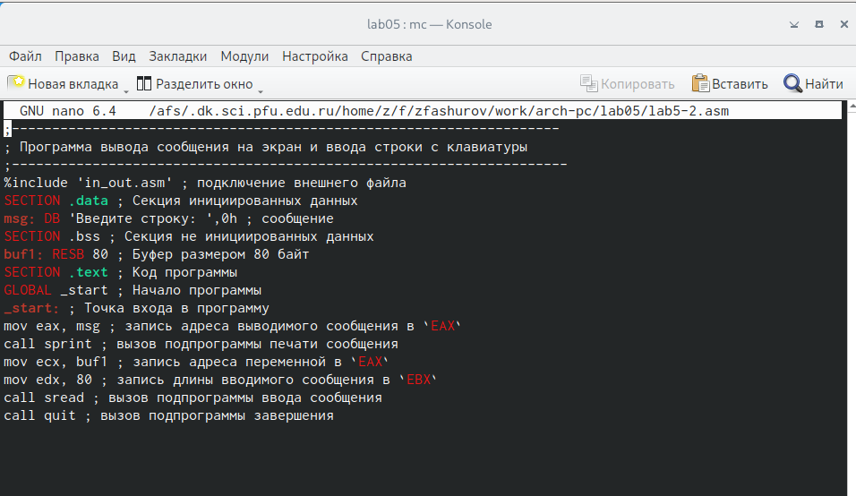{#fig:016 width=70%}

Оттранслируем текс программы (Рис. @fig:017).

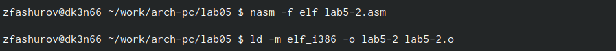{#fig:017 width=70%}

Запускаем файл (Рис. @fig:018).

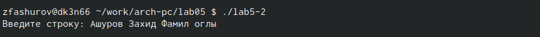{#fig:018 width=70%}

* В чем разница?

Разница между первым исполняемым и вторым файлом в том, что заупск первого запрашивает ввод с новой строки, а при запуске второго файла запрашивает ввод без переноса на новую строку. В этом и заключается различие между подпрограммой sprintLF и sprint.

# Выводы

При выполнении лабораторной работы я приобрел практические навыки работы в Midnight Commander, а также освоил инструкции языка ассемблера mov и int

# Список литературы{.unnumbered}

::: {#refs}
:::
