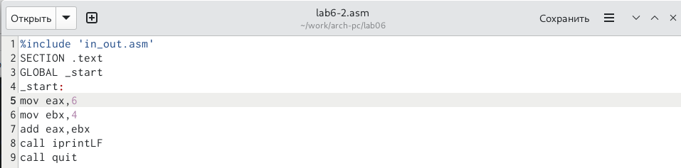

---
## Front matter
title: "Отчет по лабораторной работе №6"
subtitle: "Арифметические операции в NASM"
author: "Ашуров Захид Фамил оглы"

## Generic otions
lang: ru-RU
toc-title: "Содержание"

## Bibliography
bibliography: bib/cite.bib
csl: pandoc/csl/gost-r-7-0-5-2008-numeric.csl

## Pdf output format
toc: true # Table of contents
toc-depth: 2
lof: true # List of figures
lot: true # List of tables
fontsize: 12pt
linestretch: 1.5
papersize: a4
documentclass: scrreprt
## I18n polyglossia
polyglossia-lang:
  name: russian
  options:
	- spelling=modern
	- babelshorthands=true
polyglossia-otherlangs:
  name: english
## I18n babel
babel-lang: russian
babel-otherlangs: english
## Fonts
mainfont: PT Serif
romanfont: PT Serif
sansfont: PT Sans
monofont: PT Mono
mainfontoptions: Ligatures=TeX
romanfontoptions: Ligatures=TeX
sansfontoptions: Ligatures=TeX,Scale=MatchLowercase
monofontoptions: Scale=MatchLowercase,Scale=0.9
## Biblatex
biblatex: true
biblio-style: "gost-numeric"
biblatexoptions:
  - parentracker=true
  - backend=biber
  - hyperref=auto
  - language=auto
  - autolang=other*
  - citestyle=gost-numeric
## Pandoc-crossref LaTeX customization
figureTitle: "Рис."
tableTitle: "Таблица"
listingTitle: "Листинг"
lofTitle: "Список иллюстраций"
lotTitle: "Список таблиц"
lolTitle: "Листинги"
## Misc options
indent: true
header-includes:
  - \usepackage{indentfirst}
  - \usepackage{float} # keep figures where there are in the text
  - \floatplacement{figure}{H} # keep figures where there are in the text
---

# Цель работы

Освоить арифметические инструкции языка ассемблера NASM

# Задание

Символьные и численные данные в NASM

Выполнение арифметических операций в NASM

# Теоретическое введение

Адресация в NASM

	Большинство инструкций на языке ассемблера требуют обработки операндов. Адрес опе-
ранда предоставляет место, где хранятся данные, подлежащие обработке. Это могут быть
данные хранящиеся в регистре или в ячейке памяти. Далее рассмотрены все существующие
способы задания адреса хранения операндов – способы адресации.
	Существует три основных способа адресации:

• Регистровая адресация – операнды хранятся в регистрах и в команде используются
имена этих регистров, например: mov ax,bx.
• Непосредственная адресация – значение операнда задается непосредственно в ко-
манде, Например: mov ax,2.
• Адресация памяти – операнд задает адрес в памяти. В команде указывается символи-
ческое обозначение ячейки памяти, над содержимым которой требуется выполнить
операцию.
	
	Например, определим переменную intg DD 3 – это означает, что задается область памяти
размером 4 байта, адрес которой обозначен меткой intg. В таком случае, команда

	mov eax,[intg]

копирует из памяти по адресу intg данные в регистр eax. В свою очередь команда
	mov [intg],eax

запишет в память по адресу intg данные из регистра eax.
	
Также рассмотрим команду

	mov eax,intg

В этом случае в регистр eax запишется адрес intg. Допустим, для intg выделена память
начиная с ячейки с адресом 0x600144, тогда команда mov eax,intg аналогична команде mov
eax,0x600144 – т.е. эта команда запишет в регистр eax число 0x600144.

Целочисленное сложение add.

	Схема команды целочисленного сложения add (от англ. addition - добавление) выполняет
сложение двух операндов и записывает результат по адресу первого операнда. Команда add
работает как с числами со знаком, так и без знака и выглядит следующим образом:

	Допустимые сочетания операндов для команды add аналогичны сочетаниям операндов
для команды mov.
	Так, например, команда add eax,ebx прибавит значение из регистра eax к значению из
регистра ebx и запишет результат в регистр eax.

Примеры:
add ax,5 ; AX = AX + 5
add dx,cx ; DX = DX + CX
add dx,cl ; Ошибка: разный размер операндов.

# Выполнение лабораторной работы

Создаем каталог для программ лабораторной работы №6, переходим в него и создаем файл lab6-1.asm (Рис. @fig:001).

{#fig:001 width=70%}

Вписываем в lab6-1.asm текст из листинга 6.1 (Рис. @fig:002).

{#fig:002 width=70%}

Создаем файл lab6-1.asm (Рис. @fig:003).

{#fig:003 width=70%}

Запускаем файл lab6-1.asm (Рис. @fig:004).

{#fig:004 width=70%}

Редактируем текст файла lab6-1.asm (Рис. @fig:005).

{#fig:005 width=70%}

Создаем и запускаем измененный файл lab6-1.asm (Рис. @fig:006).

{#fig:006 width=70%}

Создаем файл lab6-2.asm (Рис. @fig:007).

{#fig:007 width=70%}

Вписываем текст в lab6-2.asm (Рис. @fig:008).

{#fig:008 width=70%}

Создаем и запускаем файл lab6-2.asm (Рис. @fig:009).

{#fig:009 width=70%}

Редактируем lab6-2.asm (Рис. @fig:010).

{#fig:010 width=70%}

Создаем и запускаем измененный файл lab6-2.asm (Рис. @fig:011).

{#fig:011 width=70%}

Меняем в тексте с inprintLF на inprint (Рис. @fig:012).

{#fig:012 width=70%}

Создаем и запускаем файл lab6-2.asm (Рис. @fig:013).

{#fig:013 width=70%}

* Разница заключается в том что 10 в первом случае была записана отдельно от строки, а вторая слипнулась с 10. 

Создаем файл lab6-3.asm (Рис. @fig:014).

{#fig:014 width=70%}

Вписываем в lab6-3.asm (Рис. @fig:015).

{#fig:015 width=70%}

Создаем и запускаем файл lab6-3.asm (Рис. @fig:016).

{#fig:016 width=70%}

Редактируем файл lab6-3.asm (Рис. @fig:017).

{#fig:017 width=70%}

Создаем и запускаем файл lab6-3.asm(Рис. @fig:018).

{#fig:018 width=70%}

Создаем файл variant.asm(Рис. @fig:019).

{#fig:019 width=70%}

# Ответы на вопросы по программе

Вопрос 1: За вывод сообщения "Ваш вариант" отвечает строка кода:
	mov eax,rem
	call sprint

Вопрос 2: Инструкция mov ecx, x используется, чтобы положить адрес вводимой строки x в регистр ecx mov edx, 80 - запись в регистр edx длины вводимой строки call sread - вызов подпрограммы из внешнего файла, обеспечивающей ввод сообщения с клавиатуры.

Вопрос 3: call atoi исользуется для вызова подпрограммы из внешнего файла, которая преобразует ascii-код символа в целое число и записывает результат в регистр eax.

Вопрос 4: За вычисления варианта отвечают строки:
	
	xor edx,edx ; обнуление edx для корректной работы div
	mov ebx,20 ; ebx = 20
	div ebx ; eax = eax/20, edx - остаток от деления
	inc edx ; edx = edx + 1

Вопрос 5: При выполнении инструкции div ebx остаток от деления записывается в регистр edx.

Вопрос 6: Инструкция inc edx увеличивает значение регистра edx на 1

Вопрос 7: За вывод на экран результатов вычислений отвечают строки:
	mov eax,edx
	call iprintLF
	
# Выводы

Я освоил арифметические инструкции языка ассемблера NASM

# Список литературы{.unnumbered}

::: {#refs}
:::
