---
## Front matter
title: "Отчет по лабораторной работе №8"
subtitle: "Программирование цикла. Обработка аргументов командной строки."
author: "Ашуров Захид Фамил оглы"

## Generic otions
lang: ru-RU
toc-title: "Содержание"

## Bibliography
bibliography: bib/cite.bib
csl: pandoc/csl/gost-r-7-0-5-2008-numeric.csl

## Pdf output format
toc: true # Table of contents
toc-depth: 2
lof: true # List of figures
lot: true # List of tables
fontsize: 12pt
linestretch: 1.5
papersize: a4
documentclass: scrreprt
## I18n polyglossia
polyglossia-lang:
  name: russian
  options:
	- spelling=modern
	- babelshorthands=true
polyglossia-otherlangs:
  name: english
## I18n babel
babel-lang: russian
babel-otherlangs: english
## Fonts
mainfont: PT Serif
romanfont: PT Serif
sansfont: PT Sans
monofont: PT Mono
mainfontoptions: Ligatures=TeX
romanfontoptions: Ligatures=TeX
sansfontoptions: Ligatures=TeX,Scale=MatchLowercase
monofontoptions: Scale=MatchLowercase,Scale=0.9
## Biblatex
biblatex: true
biblio-style: "gost-numeric"
biblatexoptions:
  - parentracker=true
  - backend=biber
  - hyperref=auto
  - language=auto
  - autolang=other*
  - citestyle=gost-numeric
## Pandoc-crossref LaTeX customization
figureTitle: "Рис."
tableTitle: "Таблица"
listingTitle: "Листинг"
lofTitle: "Список иллюстраций"
lotTitle: "Список таблиц"
lolTitle: "Листинги"
## Misc options
indent: true
header-includes:
  - \usepackage{indentfirst}
  - \usepackage{float} # keep figures where there are in the text
  - \floatplacement{figure}{H} # keep figures where there are in the text
---

# Цель работы

Приобретение навыков написания программ с использованием циклов и обработкой аргументов командной строки.

# Задание

Реализация циклов в NASM

Обработка аргументов командной строки

# Теоретическое введение

* Организация стека
	Стек — это структура данных, организованная по принципу LIFO («Last In — First Out»
или «последним пришёл — первым ушёл»). Стек является частью архитектуры процессора и
реализован на аппаратном уровне. Для работы со стеком в процессоре есть специальные
регистры (ss, bp, sp) и команды.
	Основной функцией стека является функция сохранения адресов возврата и передачи
аргументов при вызове процедур. Кроме того, в нём выделяется память для локальных
переменных и могут временно храниться значения регистров.
	Стек имеет вершину, адрес последнего добавленного элемента, который хранится в ре-
гистре esp (указатель стека). Противоположный конец стека называется дном. Значение,
помещённое в стек последним, извлекается первым. При помещении значения в стек указа-
тель стека уменьшается, а при извлечении — увеличивается.
	Для стека существует две основные операции:

	• добавление элемента в вершину стека (push);
	• извлечение элемента из вершины стека (pop).
8.2.1.1. Добавление элемента в стек.
	
	Команда push размещает значение в стеке, т.е. помещает значение в ячейку памяти, на
которую указывает регистр esp, после этого значение регистра esp увеличивается на 4.
Данная команда имеет один операнд — значение, которое необходимо поместить в стек.

push -10 	; Поместить -10 в стек
push ebx 	; Поместить значение регистра ebx в стек
push [buf] 	; Поместить значение переменной buf в стек
push word [ax] 	; Поместить в стек слово по адресу в ax

	Существует ещё две команды для добавления значений в стек. Это команда pusha, которая
помещает в стек содержимое всех регистров общего назначения в следующем порядке: ах,
сх, dx, bх, sp, bp, si, di. А также команда pushf, которая служит для перемещения в стек
содержимого регистра флагов. Обе эти команды не имеют операндов.

8.2.1.2. Извлечение элемента из стека.

	Команда pop извлекает значение из стека, т.е. извлекает значение из ячейки памяти, на
которую указывает регистр esp, после этого уменьшает значение регистра esp на 4. У этой
команды также один операнд, который может быть регистром или переменной в памяти.
	Нужно помнить, что извлечённый из стека элемент не стирается из памяти и остаётся как
“мусор”, который будет перезаписан при записи нового значения в стек.
	
	Примеры:
pop eax 	; Поместить значение из стека в регистр eax
pop [buf] 	; Поместить значение из стека в buf
pop word[si] 	; Поместить значение из стека в слово по адресу в si

Аналогично команде записи в стек существует команда popa, которая восстанавливает
из стека все регистры общего назначения, и команда popf для перемещения значений из
вершины стека в регистр флагов.

	Для организации циклов существуют специальные инструкции. Для всех инструкций
максимальное количество проходов задаётся в регистре ecx. Наиболее простой является ин-
струкция loop. Она позволяет организовать безусловный цикл, типичная структура которого
имеет следующий вид:

mov ecx, 100 ; Количество проходов
NextStep:
...
... ; тело цикла
...
loop NextStep ; Повторить `ecx` раз от метки NextStep

	Иструкция loop выполняется в два этапа. Сначала из регистра ecx вычитается единица и
его значение сравнивается с нулём. Если регистр не равен нулю, то выполняется переход к
указанной метке. Иначе переход не выполняется и управление передаётся команде, которая
следует сразу после команды loop.

# Выполнение лабораторной работы

Создаем папку и переходим в него (Рис. @fig:001)

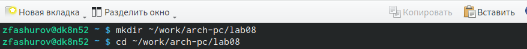{#fig:001 width=70%}

Создаем файл lab8-1.asm (Рис. @fig:002).

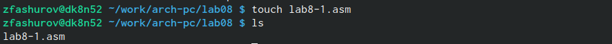{#fig:002 width=70%}

Вписываем текст из листинга в lab8-1.asm (Рис. @fig:003).

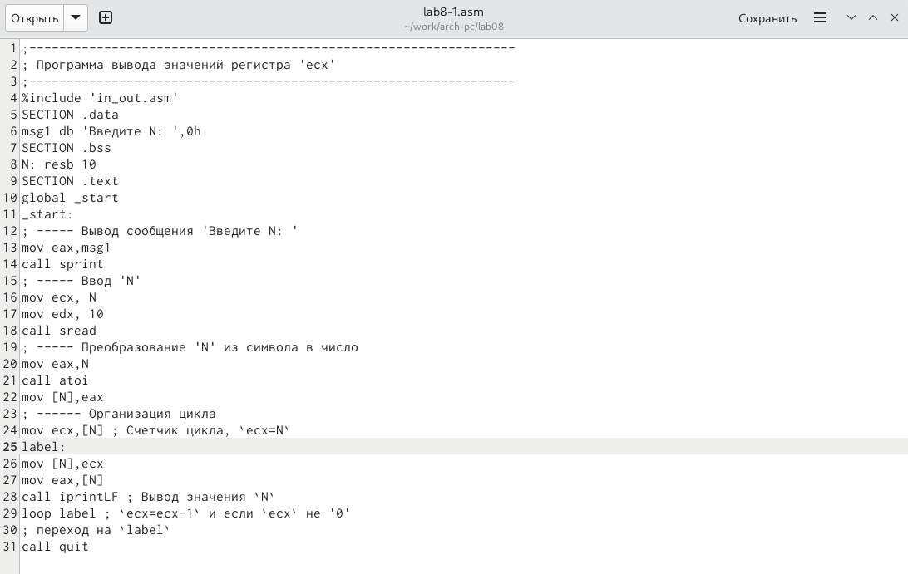{#fig:003 width=70%}

Некоректный запуск (Рис. @fig:004).

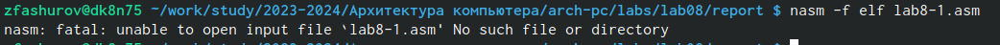{#fig:004 width=70%}

Редактируем файл lab8-1.asm (Рис. @fig:005).

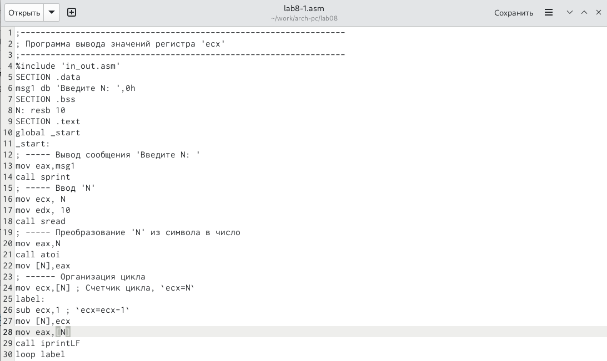{#fig:005 width=70%}

Создаем и запускаем исполняемый файл (Рис. @fig:006).

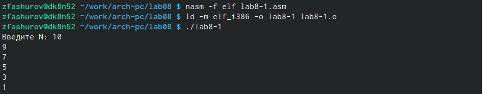{#fig:006 width=70%}

Вносим изменения в файл lab8-1.asm(Рис. @fig:007).

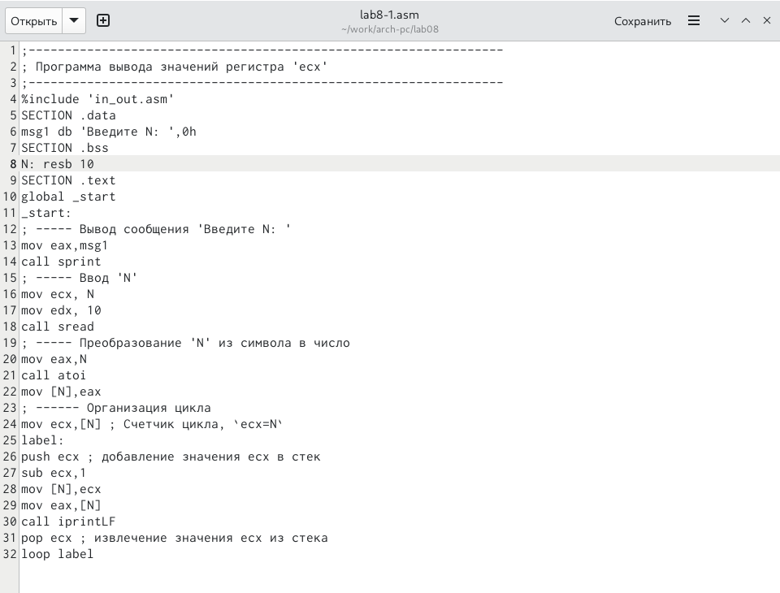{#fig:007 width=70%}

Создаем и запускаем исполняемый файл (Рис. @fig:008).

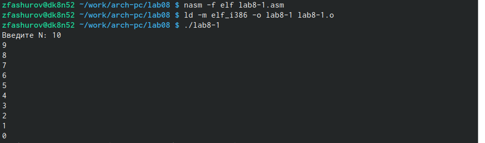{#fig:008 width=70%}

Создаем файл lab8-2.asm (Рис. @fig:009).

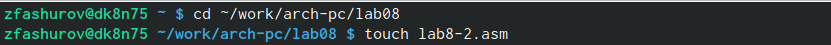{#fig:009 width=70%}

Вписываем текст из листинга в файл lab8-2.asm(Рис. @fig:010).

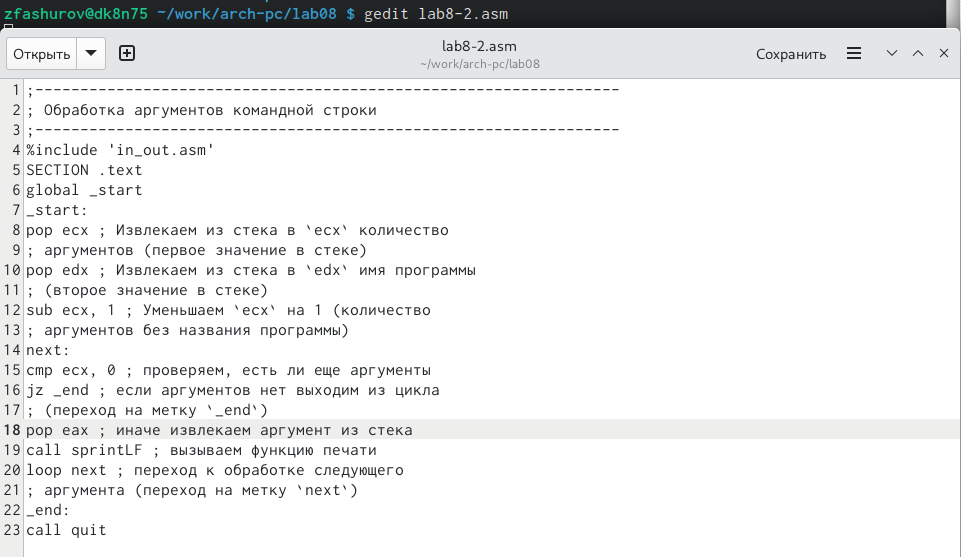{#fig:010 width=70%}

Создаем и запускаем исполняемый файл (Рис. @fig:011).

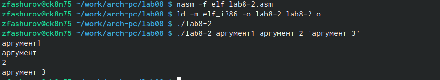{#fig:011 width=70%}

Создаем и редактируем файл lab8-3.asm (Рис. @fig:012).

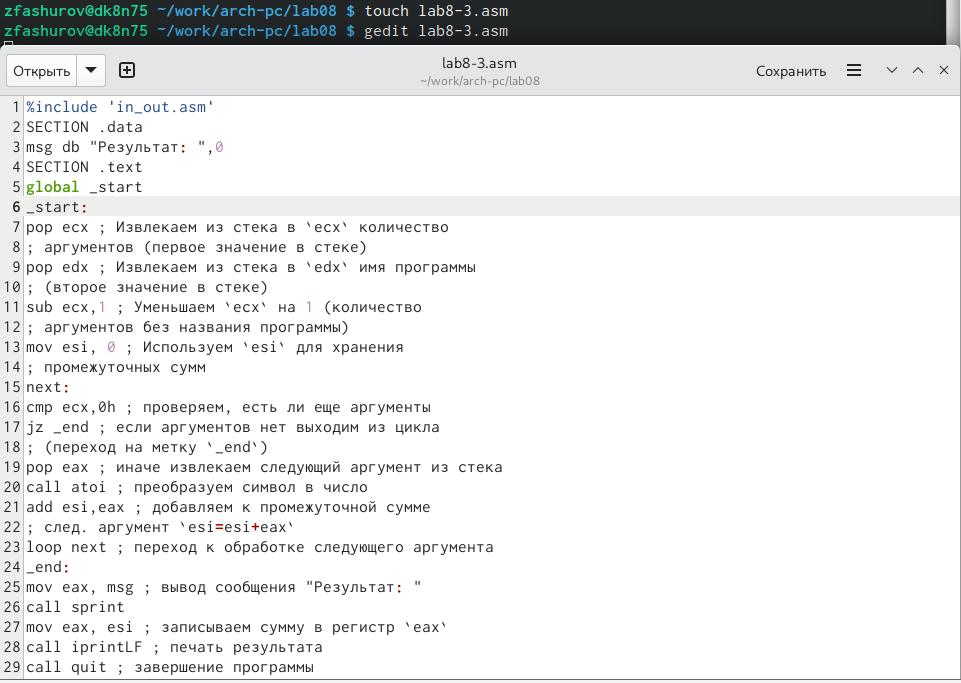{#fig:012 width=70%}

Создаем и запускаем исполняемый файл (Рис. @fig:013).

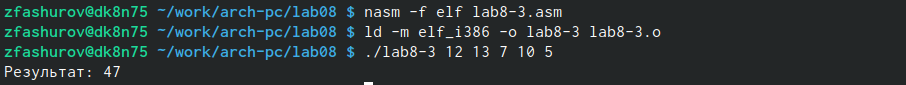{#fig:013 width=70%}

# Самостаятельная работы

Создаем файл lab8-4.asm (Рис. @fig:014).

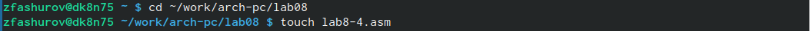{#fig:014 width=70%}

Записываем код (Рис. @fig:015).

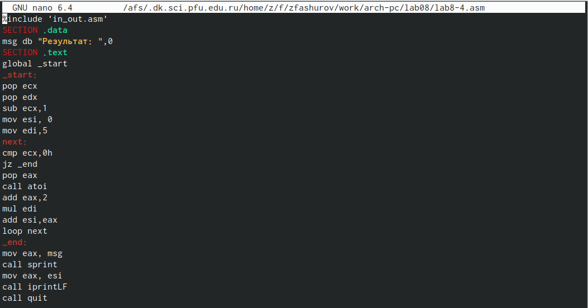{#fig:015 width=70%}

Создаем и запускаем исполняемый файл (Рис. @fig:016).

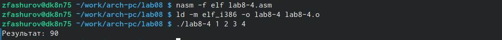{#fig:016 width=70%}

# Выводы

Я приобрел навыки написания программ с ипользованием циклов и обработкой аргументов командной строки.

# Список литературы{.unnumbered}

::: {#refs}
:::
